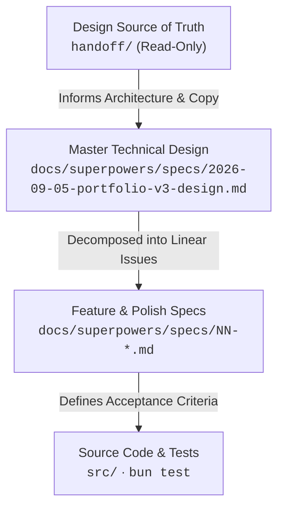

# Documentation Map (MOC) — portfolio-v3

Central index for all specifications, architectural decisions, and design references of `marcosarrieta.dev`.

---

## 1. Documentation Hierarchy & Sources of Truth

1. **Design Source of Truth**: [`handoff/`](../handoff/README.md) — Visual tokens, copy (`content.json`), animation timelines, and interactive reference mocks. In Spanish. Never edit.
2. **Master Technical Design**: [`2026-09-05-portfolio-v3-design.md`](./superpowers/specs/2026-09-05-portfolio-v3-design.md) — Core architecture, Astro 7 + Bun stack decisions, layout structure, and font choices (Manrope + IBM Plex Mono).
3. **Execution Specs**: [`docs/superpowers/specs/NN-<block>.md`](./superpowers/specs/) — One spec per Linear issue (`PV3-XX`), written and approved before implementation code.
4. **Architecture Knowledge Graph (Obsidian)**: `docs/architecture/` — the AST-extracted import graph and its visual canvas. **Generated and git-ignored**, so it is absent from a fresh clone; rebuild it with `graphify ./src --obsidian --obsidian-dir ./docs/architecture`. It is a view of the code, never a source of truth: when it disagrees with `src/`, the code is right.

---

## 2. Specifications Index by Phase

### Phase 1: Foundation & Scaffold (00 – 03)

| Spec | Title | Linear Issue | Branch | Description |
| :--- | :--- | :--- | :--- | :--- |
| [`00-scaffold.md`](./superpowers/specs/00-scaffold.md) | Scaffold & Project Setup | PV3-5 | `feat/00-scaffold` | Base Astro 7 project, Bun, TypeScript strict, and Tailwind v4. |
| [`01-tokens-tema.md`](./superpowers/specs/01-tokens-tema.md) | Tokens & Theme System | PV3-6 | `feat/01-tokens-tema` | `@theme` tokens, `light-dark()` color system, and Manrope/IBM Plex typography. |
| [`02-content-i18n.md`](./superpowers/specs/02-content-i18n.md) | Content Loader & i18n | PV3-7 | `feat/02-content-i18n` | Typed copy loader (`src/lib/content.ts`), `/` (ES) and `/en` (EN) routing. |
| [`03-base-layout.md`](./superpowers/specs/03-base-layout.md) | Base Layout | PV3-8 | `feat/03-base-layout` | `Base.astro` container, theme flash prevention script, metadata, font preloads. |

---

### Phase 2: Core Sections (04 – 14)

| Spec | Title | Linear Issue | Branch | Refined By / Status |
| :--- | :--- | :--- | :--- | :--- |
| [`04-nav.md`](./superpowers/specs/04-nav.md) | Navigation Bar | PV3-9 | `feat/04-nav` | Smooth scroll, lang switcher, theme toggle. Refined in [`20-nav-align.md`](./superpowers/specs/20-nav-align.md). |
| [`05-hero.md`](./superpowers/specs/05-hero.md) | Hero (Left Column) | PV3-10 | `feat/05-hero` | Initial hero layout & boot sequence. Refined in [`27-hero.md`](./superpowers/specs/27-hero.md). |
| [`06-console.md`](./superpowers/specs/06-console.md) | Agent Console Card | PV3-11 | `feat/06-console` | Decorative console card, status badges, scramble effect. |
| [`07-network-canvas.md`](./superpowers/specs/07-network-canvas.md) | Interactive Node Canvas | PV3-12 | `feat/07-network-canvas` | 2D node network with mouse repel and constellation physics. |
| [`08-about.md`](./superpowers/specs/08-about.md) | About Section | PV3-13 | `feat/08-about` | Bio text, stats grid, and word-by-word scroll reveal. |
| [`09-method.md`](./superpowers/specs/09-method.md) | Method ("How I Work") | PV3-14 | `feat/09-method` | 5-step methodology card sequence and scroll progress pinning. |
| [`10-experience.md`](./superpowers/specs/10-experience.md) | Experience Section | PV3-15 | `feat/10-experience` | Career timeline and role cards. Refined in [`23-experience.md`](./superpowers/specs/23-experience.md). |
| [`11-projects.md`](./superpowers/specs/11-projects.md) | Featured Projects | PV3-16 | `feat/11-projects` | Project cards, iframe previews/fallbacks. Refined in [`24-projects.md`](./superpowers/specs/24-projects.md). |
| [`12-stack.md`](./superpowers/specs/12-stack.md) | Tech Stack | PV3-17 | `feat/12-stack` | Double marquee chips. Refined in [`22-stack.md`](./superpowers/specs/22-stack.md). |
| [`13-contact.md`](./superpowers/specs/13-contact.md) | Contact Section | PV3-18 | `feat/13-contact` | Contact card, copy email button, and socials. |
| [`14-footer.md`](./superpowers/specs/14-footer.md) | Footer | PV3-19 | `feat/14-footer` | Colophon, copyright, back-to-top behavior. |

---

### Phase 3: Quality, A11y & E2E Validation (16 – 17)

| Spec | Title | Linear Issue | Branch | Description |
| :--- | :--- | :--- | :--- | :--- |
| [`16-a11y.md`](./superpowers/specs/16-a11y.md) | Accessibility Audit | PV3-21 | `feat/16-a11y` | ARIA landmarks, keyboard focus rings, `prefers-reduced-motion` compliance. |
| [`17-e2e-lighthouse.md`](./superpowers/specs/17-e2e-lighthouse.md) | E2E & Lighthouse Suite | PV3-22 | `feat/17-e2e-lighthouse` | Playwright smoke tests, Lighthouse CI verification (scores ≥ 90 across all metrics). |

---

### Phase 4: Containerization & Mock Parity Polish (19 – 27)

These specs addressed pixel-perfect visual alignment, container overflow bugs, and mock parity measurements.

| Spec | Title | Linear Issue | Target Component | Original Spec Refined |
| :--- | :--- | :--- | :--- | :--- |
| [`19-page-container.md`](./superpowers/specs/19-page-container.md) | Page Container Alignment | PV3-24 | Layout | Establishes the global `.container-page` 1200px max-width boundary. |
| [`20-nav-align.md`](./superpowers/specs/20-nav-align.md) | Nav Horizontal Align | PV3-25 | `Nav.astro` | Aligns navigation bar inner content to the 1200px grid. Refines [`04-nav.md`](./superpowers/specs/04-nav.md). |
| [`22-stack.md`](./superpowers/specs/22-stack.md) | Stack Row Containment | PV3-27 | `Stack.astro` | Fixes 3540px horizontal page overflow caused by `auto` grid track max-content. Refines [`12-stack.md`](./superpowers/specs/12-stack.md). |
| [`23-experience.md`](./superpowers/specs/23-experience.md) | Experience Polish | PV3-28 | `Experience.astro` | Centers timeline dot on job headers; fixes "Also with" chips to horizontal row. Refines [`10-experience.md`](./superpowers/specs/10-experience.md). |
| [`24-projects.md`](./superpowers/specs/24-projects.md) | Projects Polish | PV3-29 | `Projects.astro` | Resolves preview aspect ratio and card padding against mock. Refines [`11-projects.md`](./superpowers/specs/11-projects.md). |
| [`27-hero.md`](./superpowers/specs/27-hero.md) | Hero Mock Parity | PV3-32 | `Hero.astro` | Resolves hero height to 918px (+1.0% of mock), fold clearance (y=872), node center x=862. Refines [`05-hero.md`](./superpowers/specs/05-hero.md). |

---

### Phase 5: Architecture & Knowledge Graphs (28)

| Spec | Title | Linear Issue | Target Area | Description |
| :--- | :--- | :--- | :--- | :--- |
| [`28-docs-and-knowledge-graphs.md`](./superpowers/specs/28-docs-and-knowledge-graphs.md) | Documentation Map, Obsidian Vault & CodeGraph | PV3-33 | Tooling & Docs | Central MOC, bidirectional spec lineage, 175-note Obsidian vault, and CodeGraph AST index. |

---

## 3. Note on Numbering Gaps

The spec prefix numbers (`NN`) correspond to the chronological delivery order of features and polish iterations in the development cycle. Missing numbers (such as 15, 18, 21, 25, 26) were dedicated to Linear backlog tasks that did not require a standalone superpower spec (e.g., asset imports, DNS configuration, and direct dependency bumps).
